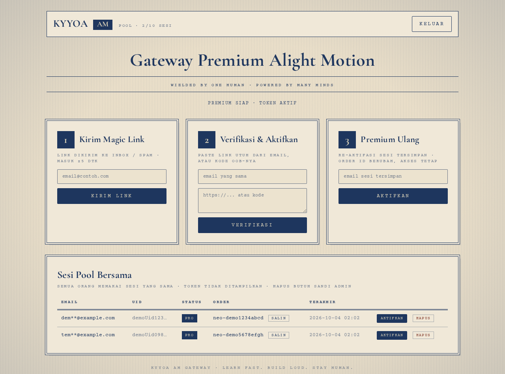

# kyyoaAM gateway

Gateway premium-style + web UI single-page untuk mengelola **pool sesi bersama**:
login sekali, status premium dicek ke provider, sesi dipakai rame-rame tanpa login ulang.

> ⚠️ **Versi publik (pamer + arsip).** Logic auth/verify ke provider asli
> (`lib/auth.js`) di sini berupa **stub** — interface sama, implementasi dikosongkan.
> Versi produksi yang jalan live tetap private.



## Fitur

- 🔐 Login web (cookie HMAC-SHA256, 12 jam) + API key (`X-Gateway-Key`)
- 🎫 Magic-link flow: kirim link → verifikasi → sesi tersimpan di pool
- 👥 Pool bersama (cap `MAX_POOL`), email di-mask server-side (`agu**@gmail.com`)
- 🛡️ Anti-abuse: kuota bikin akun/hari/IP, cooldown re-aktivasi per sesi,
  rate limit global + per-endpoint, hapus sesi butuh sandi admin
- 🎨 UI gaya poster: parchment + navy ink, serif + typewriter mono
- 📦 Stdlib-first — 1 dependensi (`axios`), Node 20+

## Struktur

```
server.js          router stdlib (login, rate limit, pool API, static)
lib/auth.js        STUB publik (link/verify/refresh/premium/extractCode)
lib/store.js       sessions.json atomic (chmod 600) + masking
lib/ratelimit.js   token bucket allow/peek/consume
lib/validate.js    validasi email
public/            UI: index.html + app.css + app.js
test.js            18 unit test (node --test style manual)
.env.example       contoh config — copy ke .env lalu isi
```

## Jalankan

```bash
cp .env.example .env   # isi LOGIN_SHA256 (sha256 sandi) + ADMIN_PASS
npm install
npm test               # 18 pass
node server.js         # http://127.0.0.1:20140/
```

Bikin sha256 sandi:

```bash
node -e "console.log(require('crypto').createHash('sha256').update('sandimu').digest('hex'))"
```

## Config (`.env`)

| Key | Default | Arti |
|---|---|---|
| `HOST` / `PORT` | `127.0.0.1` / `20140` | bind lokal |
| `LOGIN_SHA256` | — | sha256 sandi login web |
| `ADMIN_PASS` | — | sandi hapus sesi (kosong = terbuka) |
| `GATEWAY_KEY` | auto-generate | kunci API `X-Gateway-Key` |
| `MAX_POOL` | `10` | kapasitas pool |
| `CREATE_PER_DAY` | `1` | tambah sesi/hari/IP (gagal verifikasi tidak makan jatah) |
| `PREM_COOLDOWN` | `60` | detik antar re-aktivasi per sesi |

## API (butuh cookie login atau `X-Gateway-Key`)

| Method | Path | Arti |
|---|---|---|
| `GET` | `/health` | status + versi |
| `POST` | `/api/login` / `/api/logout` / `/api/me` | sesi web |
| `POST` | `/link` | kirim magic link (`{email}`) |
| `POST` | `/verify` | verifikasi (`{email, link}`) → sesi pool |
| `POST` | `/premium` / `/refresh` | re-aktivasi (`{email}` / `{uid}`) |
| `GET` | `/sessions` | list pool (masked) + `limit` |
| `DELETE` | `/sessions` | hapus (`{uid|email, admin}`) |

## Catatan versi publik vs private

| | Publik (repo ini) | Private (live) |
|---|---|---|
| `lib/auth.js` | stub, selalu `ok:false` + pesan konfigurasi | implementasi penuh ke provider |
| `.env` | cuma `.env.example`, tanpa nilai | nilai asli di server, tidak dipublish |
| `sessions.json` | di-gitignore, tidak ada | live di server (chmod 600) |
| UI / router / anti-abuse / test | ✅ sama persis | ✅ sama persis |

Mau jalanin beneran: implementasikan `link/verify/refresh/premium` di
`lib/auth.js` sesuai penyedia auth masing-masing — sisanya langsung jalan.

— Kyyoa · learn fast, build loud, stay human.
